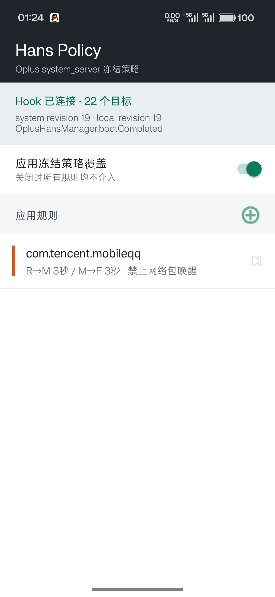
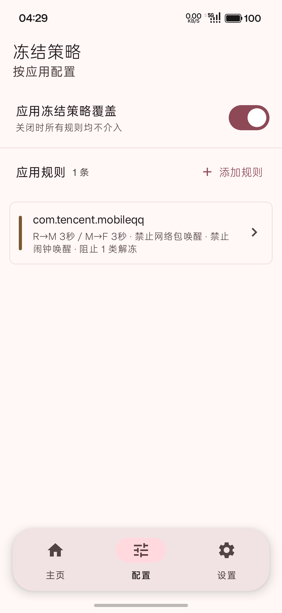
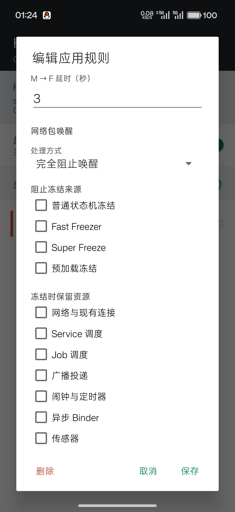

# Oplus Hans Policy

[English](README.md)

一个按应用覆盖 Oplus Hans/OFreezer 策略的 LSPosed 模块。模块运行在
`system_server`，规则只保存包名，在命中时动态解析实际 UID；它不会写内核 freezer
文件，也不会替换厂商状态机。

> [!WARNING]
> 本模块 Hook `system_server` 中的 Oplus 私有 API，并且与 ROM 版本强相关。不兼容的
> OTA 可能导致系统启动异常。请提前保留 LSPosed/Vector 安全模式入口，首次测试时保持
> 管理应用内的策略总开关关闭。

<p align="center">
  
  
  
</p>

## 问题与控制链

在已验证的 Oplus Android 16 固件中，数秒级后台冻结由 `system_server` 内的 Hans
执行：

```text
应用离开前台
  -> HansAppStateMachine: Running（R）
  -> Middle（M）：代理组件、整理内存
  -> Frozen（F）
  -> HansCGroup.hansFreezeLocked()
  -> Process.freezeCgroupUid(uid, true)
  -> /sys/fs/cgroup/apps/uid_<uid>/cgroup.freeze
```

Athena 是厂商策略配置的提供者和更新通道，实时决策与最终 cgroup 动作仍在
Hans/OFreezer。只修改 Athena 静态名单，不能精确覆盖所有运行时入口。

网络包是另一条重要解冻路径。QQ 的 MSF/iLink 等持久连接收到数据后，Hans native
monitor 会进入 `OplusHansManager.unfreezeForKernel(type=4)`，并以 `reason=Packet`
解冻整个 UID。本模块可以允许、限频或阻止这个事件。

Alarm 是独立的周期解冻路径。QQ 的 MSF/iLink 会注册 `ELAPSED_WAKEUP` 闹钟；在已验证
样本中动态编号的 `ALARM_ACTION(...)` 约每 5 分钟触发一次，并进入
`OplusHansManager.checkAlarmIfRestricted`，随后以 `reason=Alarm` 解冻 UID。本模块可独立
允许、限频或阻止 Alarm 唤醒，不影响前台使用。

Binder 与 Packet、WakeLock 都不是同一条链。内核 `type=0` 回调命中厂商异步 Binder
白名单后，会以 `reason=W_AsyncBinder` 解冻整个 UID。本模块可在 native process-freezer
实际 thaw 之前阻止该回调，并用最终解冻闸门覆盖组件、系统场景和未来未知 reason。

## 功能

- 规则只以包名为键，运行时动态解析 UID，不保存 UID 或 Android 用户 ID。
- 完全豁免 Hans，并在最终 cgroup 冻结入口守门。
- 分别覆盖 R 到 M、M 到 F 的状态时序。
- 分别阻止普通状态机、Fast Freezer、Super Freeze、预加载四类冻结来源。
- 即使允许 cgroup 冻结，也可选择保留网络、Service、Job、广播、闹钟、Binder、
  传感器、GPS、WakeLock、音频和蓝牙扫描行为。
- 网络包唤醒可选择跟随系统、限制最短唤醒间隔或完全阻止。
- 可单独设置 Packet 解冻后的再次冻结延时。
- 闹钟唤醒可独立选择跟随系统、限制最短唤醒间隔或完全阻止。
- 可单独设置 Alarm 解冻后的再次冻结延时。
- 可分别阻止异步/同步/事务 Binder、Signal、Activity/Input、Service、Broadcast、
  Provider、Job/Sync、WakeLock、音频媒体、连接状态、系统场景和未来未知解冻原因。
- Direct Boot 策略存储，保存后动态重载，不需要重启 `system_server`。
- 管理界面上报 boot ID、策略 revision、初始化来源、Hook 数量和错误。
- 配置解析、包名解析或单个 Hook 失败时 fail-open，保留厂商原行为。

全新安装时策略总开关默认关闭；只有打开总开关后规则才会介入。

## 兼容性

| 项目 | 已验证值 |
| --- | --- |
| 设备 | OnePlus PKX110 |
| 系统 | Android 16 / API 36 |
| 固件 | `PKX110_16.0.9.401(CN01)` |
| 逆向样本 | 上述固件的 Oplus `oplus-services.jar` |
| 当前源码版本 | `0.6.0`（`versionCode 8`） |
| Hook 进程 | `android` / `system_server` |
| 框架 | LSPosed API 82 兼容；同时在 Vector Framework 2.0 验证 |

当前没有宣称适配其他 ColorOS/OxygenOS 版本。每次 OTA 后都应先核对核心方法签名，
确认 27 个 Hook 全部安装成功，再重新打开策略总开关。

## 安装

1. 从 [最新 Release](https://github.com/whitewhale0612/Oplus-Hans-Policy/releases/latest)
   下载 `HansPolicy-v0.6.0.apk`。
   安装前核对 SHA-256：

   ```text
   235c1ce6945042a3a0ffa6a40831aae6f2c432dbd09fc3517dbc5f8848e6a781
   ```

2. 安装或覆盖更新：

   ```bash
   adb install --no-incremental -r HansPolicy-v0.6.0.apk
   ```

3. 在 LSPosed/Vector 中启用 **Hans Policy**。
4. 作用域只选择 **系统框架**（`android` / `system`），不需要选择目标应用。
5. 重启设备。
6. 打开管理应用，确认显示“Hook 已连接 · 27 个目标”，并且 system/local revision
   一致。
7. 先添加一条测试规则，最后再打开管理应用内的策略总开关。

应用重装、后台进程重建或 UID 变化后不需要修改规则。模块会优先从 Hans 内部对象取
包名，失败时再通过 PackageManager 按当前 UID 解析。

## 策略说明与推荐

三个名称相近的区域实际控制不同阶段：**阻止冻结来源**让应用不进入 Frozen，**冻结时
保留资源**放宽 Hans 对资源和事件的代理，**阻止解冻来源**则在应用已经 Frozen 后拒绝
指定事件将其唤醒。建议从全不勾选开始，根据日志一次只增加一个控制项。

### 基础与时序

| 项目 | 作用 | 可能影响 | 推荐 |
| --- | --- | --- | --- |
| 策略总开关 | 同时启停全部包名规则。 | 打开后所有已启用规则立即介入。 | 首次安装、OTA 后先关闭；确认 27 个 Hook 正常后再打开。 |
| 启用此规则 | 只启停当前包名规则，不删除配置。 | 关闭后该应用完全跟随系统。 | 用于 A/B 对比和故障排查。 |
| 完全豁免 Hans | 阻止该应用进入 Hans 冻结及限制。 | 后台 CPU、网络和耗电可能明显增加；下方解冻控制失去意义。 | 仅用于导航、持续播放等确实不能冻结的应用，不建议普通应用开启。 |
| 自定义 R / M / F 时序 | 用下方两个延时覆盖 Hans 默认状态时序。 | 不合理的组合会造成过早冻结、后台功能延迟或频繁冻融。 | 默认关闭；先记录系统实际时序，再只调整确有问题的应用。 |
| R→M 延时 | 控制应用离开前台后从 Running 进入 Middle 的等待时间。 | 过短会更早代理组件，过长会增加后台活跃时间。 | 优先跟随系统；需要自定义时从 10-30 秒开始测试。 |
| M→F 延时 | 控制 Middle 进入 Frozen 的等待时间。 | 过短容易频繁冻融，过长降低省电效果。 | 优先跟随系统；3 秒属于激进值，只用于已验证应用。 |

### 阻止冻结来源

勾选表示“禁止这种机制冻结应用”，不是加强冻结。

| 项目 | 作用 | 可能影响 | 推荐 |
| --- | --- | --- | --- |
| 普通状态机冻结 | 阻止常规 R/M/F 状态机执行最终冻结。 | 大部分后台冻结都会失效，耗电上升。 | 默认关闭；通常应改时序而不是阻止它。 |
| Fast Freezer | 阻止厂商快速冻结入口。 | 应用离开前台后可能保持活跃更久。 | 仅在确认 Fast Freezer 导致功能异常时开启。 |
| Super Freeze | 阻止更强的 Super Freeze 场景。 | 长时间后台限制减弱，待机耗电可能增加。 | 默认关闭。 |
| 预加载冻结 | 阻止预加载应用专用冻结入口。 | 预加载进程可能长期驻留。 | 仅对确认属于预加载链路的应用开启。 |

### 冻结时保留资源

这些选项绕过 Hans 对相应资源的代理或回收；它们不保证被冻结的线程能够继续执行。

| 项目 | 作用 | 可能影响 | 推荐 |
| --- | --- | --- | --- |
| 网络与现有连接 | 保留防火墙放行状态和已有连接。 | 冻结期间仍可能有网络流量，长连接更难自然断开。 | 仅对必须保活的通信连接开启；若目标是阻止 Packet 唤醒则通常关闭。 |
| Service 调度 | 不代理 Service 事件。 | Service 可能触发更多解冻和后台工作。 | 仅在后台服务被延迟导致功能缺失时开启。 |
| Job 调度 | 不代理 JobScheduler 任务。 | 定时维护任务更频繁运行。 | 默认关闭；生产力同步类应用按需开启。 |
| 广播投递 | 不代理 Broadcast。 | 系统和应用广播可能频繁唤醒进程。 | 默认关闭。 |
| 闹钟与定时器 | 不代理 Alarm。 | 周期闹钟会恢复，增加唤醒。 | 阻止/限频 Alarm 时必须关闭；闹钟类应用才建议开启。 |
| 异步 Binder | 不代理相应 Binder 调用。 | 可能恢复 `W_AsyncBinder` 等唤醒。 | 需要阻止 Binder 唤醒时关闭。 |
| 传感器 | 保留传感器使用。 | 持续采样会增加功耗。 | 仅运动、健康等明确依赖传感器的应用开启。 |
| 定位 / GPS | 保留定位资源。 | 定位、射频和后台耗电显著增加。 | 仅导航、轨迹记录场景开启。 |
| WakeLock | 保留应用 WakeLock。 | 可能阻止设备深度休眠。 | 默认关闭，除非已确认任务因 WakeLock 被代理而中断。 |
| 音频 | 保留音频相关行为。 | 后台音频和音频焦点可能持续。 | 音乐、通话应用按需开启。 |
| 蓝牙扫描 | 保留蓝牙扫描。 | 扫描功耗增加，也可能带来更多回调。 | 穿戴设备或配件应用按需开启。 |

### 阻止解冻来源

勾选表示应用已经冻结时，不允许该类事件解冻 UID。未识别的新 framework reason 会进入
“其他与未来未知原因”。

| 项目 | 作用 | 可能影响 | 推荐 |
| --- | --- | --- | --- |
| 异步 Binder（含 `W_AsyncBinder`） | 在 native thaw 前拦截异步 Binder 回调。 | 电话状态、观察者及其他单向回调会延迟。 | 日志确认存在无用唤醒后开启；当前 QQ 样本推荐开启。 |
| 同步 Binder | 阻止同步 Binder 解冻。 | 调用方可能阻塞、超时或报错。 | 高风险，默认关闭。 |
| 事务 Binder | 阻止事务型 Binder 解冻。 | 跨进程功能可能失效。 | 默认关闭，只针对已定位的无用事务。 |
| 进程 Signal | 阻止 Signal 触发解冻。 | 终止、诊断或 native 恢复流程可能延迟。 | 高风险，默认关闭。 |
| Activity / Input | 阻止前台 Activity、重启 Activity 和输入事件解冻。 | 用户可能无法正常打开或操作应用。 | 极高风险，不建议开启。 |
| Service / Bind / Restart | 阻止服务启动、绑定和重启解冻。 | 推送服务、前台服务或依赖绑定可能失败。 | 默认关闭；非关键后台服务可谨慎测试。 |
| Broadcast | 阻止广播解冻。 | 推送、系统状态和应用事件会延迟。 | 普通非通信应用可测试；通信应用通常关闭。 |
| Content Provider | 阻止 Provider 访问解冻。 | 调用方查询可能阻塞或失败。 | 高风险，默认关闭。 |
| Job / Sync | 阻止计划任务和同步解冻。 | 云同步、备份和维护任务推迟。 | 不依赖后台同步的应用可开启。 |
| WakeLock | 阻止 WakeLock 归因触发解冻。 | 依赖 WakeLock 完成的后台任务可能失败。 | 对确认存在无效 WakeLock 唤醒的应用开启。 |
| 音频 / 媒体 / 蓝牙控制 | 阻止播放、媒体按键或蓝牙控制解冻。 | 后台播放、耳机控制和通话功能可能失效。 | 媒体/通话应用关闭；普通应用可按日志测试。 |
| 网络状态 / 导航 / 流量 | 阻止连接状态、导航及流量场景解冻。 | 网络切换和导航状态不能及时处理。 | 默认关闭；无后台网络需求的应用可测试。 |
| 系统场景与生命周期 | 阻止屏幕、休眠退出、Watchdog 等系统场景解冻。 | 可能破坏生命周期恢复和系统清理。 | 极高风险，不建议开启。 |
| 其他与未来未知原因 | 拦截所有未分类 framework reason。 | OTA 新增的必要原因也会被阻止，排障困难。 | 默认关闭，只用于短期诊断。 |

### 推荐配置模板

| 目标 | 推荐配置 |
| --- | --- |
| 保守观察 | 跟随系统时序，Packet/Alarm 跟随系统，其余全部不勾选；先通过日志识别原因。 |
| 普通非即时通信应用 | Packet 限频 60-300 秒，Alarm 限频 15 分钟；按日志选择异步 Binder、Job/Sync 或 WakeLock，其他保持关闭。 |
| 当前 QQ 样本的激进冻结 | Packet 完全阻止、Alarm 完全阻止、只勾选异步 Binder；不要勾选 Activity/Input、系统场景、同步 Binder、Provider 或 Signal。消息和 VoIP 可能延迟。 |
| 必须实时工作的应用 | 优先只保留确有需要的网络、音频、定位等资源；仍无法工作时再考虑完全豁免 Hans。 |

## 网络包唤醒

| 模式 | 作用 | 可能影响 | 推荐 |
| --- | --- | --- | --- |
| 跟随系统 | 每次 Packet 事件都交给 Hans 原逻辑处理。 | 后台网络包可能频繁解冻应用。 | 即时通信、VoIP 或首次测试时使用。 |
| 限制唤醒频率 | 首个 Packet 允许解冻，冷却时间内的后续事件被拦截。 | 冷却窗口内消息或网络任务会延迟。 | 平衡方案，建议从 60-300 秒开始。 |
| 完全阻止唤醒 | 匹配 UID 的所有 `type=4` Packet 解冻调用都被拦截。 | 消息、VoIP、长连接推进可能延迟到其他解冻或前台启动。 | 仅对不要求后台实时通信的应用开启。 |
| 最短唤醒间隔 | 在“限制唤醒频率”模式下设置两次允许解冻之间的冷却时间。 | 数值越长，唤醒越少，但网络事件延迟越明显。 | 从 60-300 秒开始；跟随系统或完全阻止时不生效。 |
| 自定义网络唤醒后保持时间 | Packet 解冻后，单独覆盖本次 M→F 的再次冻结延时。 | 过短可能使网络任务尚未完成就再次冻结；过长会扩大后台运行窗口。 | 默认关闭；确认任务完成耗时后再设置，建议先从 5-15 秒测试。完全阻止时不生效。 |

完全阻止可能延迟消息、VoIP 信令、长连接推进和其他后台网络工作。该功能不是防火墙，
不会直接丢弃数据包；它阻止的是 Hans 因该网络包解冻 UID。通信应用必须实际测试。

“自定义网络唤醒后保持时间”只覆盖 `reason=Packet` 的 M 到 F 时序。如果应用同时获得
音频焦点、前台服务或其他系统场景，Hans 状态机仍可能拒绝当次转 F；模块不会伪造冻结
成功状态。

## 闹钟唤醒

| 模式 | 作用 | 可能影响 | 推荐 |
| --- | --- | --- | --- |
| 跟随系统 | Alarm 到期后交给 Hans 原逻辑处理。 | 周期 Alarm 可能频繁解冻应用。 | 闹钟、日历、健康提醒等时效性应用使用。 |
| 限制唤醒频率 | 首个 Alarm 允许解冻，冷却时间内的后续事件继续留在代理队列。 | 窗口内的定时任务延迟。 | 平衡方案，默认间隔 15 分钟。 |
| 完全阻止唤醒 | 匹配包的 Alarm 不投递，不触发 `reason=Alarm` 解冻。 | 后台定时任务、提醒或保活可能不执行。 | 对确认无时效需求的周期唤醒开启。 |
| 最短唤醒间隔 | 在“限制唤醒频率”模式下设置两次允许 Alarm 解冻之间的冷却时间。 | 数值越长，周期任务合并或延迟越明显。 | 默认 15 分钟；跟随系统或完全阻止时不生效。 |
| 自定义闹钟唤醒后保持时间 | Alarm 解冻后，单独覆盖本次 M→F 的再次冻结延时。 | 过短可能截断定时任务，过长会让周期 Alarm 带来额外后台活动。 | 默认关闭；仅在任务需要固定执行窗口时开启，建议先从 10-30 秒测试。完全阻止时不生效。 |

该策略控制的是被冻结应用的 Alarm 投递，不是删除应用注册的闹钟。“冻结时保留资源”
中的“闹钟与定时器”语义相反，它用于绕过 Hans 的 Alarm 代理；需要阻止周期唤醒时不要
同时启用该资源保留项。

## 验证

查看模块与 Hans 日志：

```bash
adb logcat -v time | grep -E 'HansPolicy|OplusHansManager'
```

Release 构建仅输出一次 Hook 安装结果和安装阶段错误，不输出 Packet、Alarm、Binder 等
高频策略事件，以降低 system_server 开销。以下详细事件日志仅由 Debug 构建输出：

```text
HansPolicy: installed 27 hooks
HansPolicy: Wake source blocked uid=<uid> pkg=<package> source=AsyncBinder reason=kernel:AsyncBinder detail=<aidl>/<code> caller=<pid>/<uid>
HansPolicy: Packet wake blocked uid=<uid> pkg=<package>
HansPolicy: Packet wake throttled uid=<uid> pkg=<package>
HansPolicy: Alarm wake blocked uid=<uid> pkg=<package> action=<action>
HansPolicy: Alarm batch broadcast suppressed uid=<uid> pkg=<package>
OplusHansManager: unfreeze uid: <uid> ... reason: Packet
OplusHansManager: freeze uid: <uid> ...
```

冻结后的内核状态：

```bash
adb shell su -c 'cat /sys/fs/cgroup/apps/uid_<uid>/cgroup.events'
```

预期包含 `frozen 1`。v0.5.0 的设备测试证据见
[真机验证记录](docs/VERIFICATION_CN.md)。

## 构建

要求：

- JDK 17 或更高版本
- Android SDK `platforms;android-35`
- Android SDK `build-tools;35.0.0`
- 设置 `ANDROID_HOME` / `ANDROID_SDK_ROOT`，或创建本地 `local.properties`

Linux/macOS：

```bash
chmod +x scripts/build.sh
./scripts/build.sh
```

Windows：

```bat
scripts\build.bat
```

默认会执行 lint，并生成 `dist/HansPolicy-v0.6.0-debug.apk`。Xposed API 82 JAR 使用
`compileOnly`，不会打入 APK。

也可以直接执行：

```bash
./gradlew lintDebug assembleDebug
```

## 仓库结构

```text
app/                 Android 管理应用与 LSPosed Hook 源码
docs/                架构、验证记录与界面截图
scripts/             Linux/macOS 与 Windows 构建脚本
.github/workflows/   lint 与可复现 debug 构建
dist/                本地构建输出（gitignored）
artifacts/           本地签名与发布产物（gitignored）
```

## 恢复

正常情况下，在管理应用内关闭总开关即可立即恢复系统原策略。如果设备无法稳定进入
桌面，请从框架安全模式禁用模块后重启。Vector Framework 用户可以执行：

```bash
adb shell /data/adb/modules/zygisk_vector/cli modules disable io.github.whitewhale.hanspolicy
adb reboot
```

模块没有修改 RUS 数据、系统属性或 cgroup 文件，禁用后没有额外厂商配置需要恢复。

## 限制

- Oplus 私有方法签名可能随固件变化。
- 完全豁免和资源保留会明显改变后台功耗。
- 阻止 Packet 唤醒可能延迟用户可见的通信事件。
- Activity/Input 与系统场景属于高风险控制，启用后可能阻止正常前台打开或系统生命周期
  恢复，因此默认不勾选。
- Android shared UID 下的多个包仍会作为同一个 UID 被控制。
- 已经进入 Handler 队列的旧状态消息不会被重排；新时序从下一次状态转换生效。

完整设计与 27 个 Hook 的映射见[架构文档](docs/ARCHITECTURE_CN.md)。
